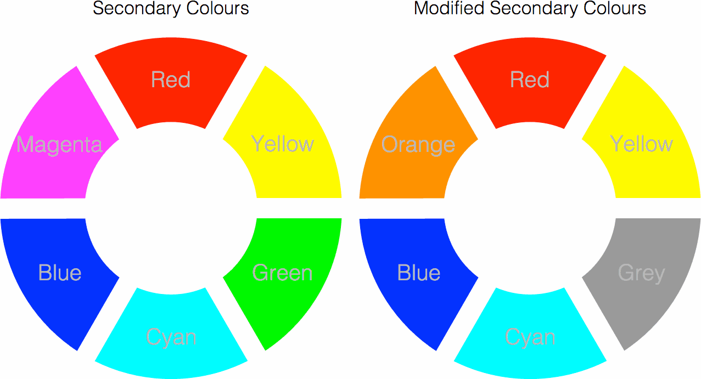

# D3 Color Wheel

D3 plugin for displaying color wheels.



## Usage

```javascript
var data = [{
    title: "Primary Colours",
    colors: [
        {label: 'Red', color: "#f00"},
        {label: 'Green', color: "#0f0"},
        {label: 'Blue', color: "#00f"}
    ]
}];

var colorWheel = d3.colorWheel().width(300).height(360);

var svg = d3.select("body").selectAll("svg")
    .data(data)
  .enter().append("svg")
    .call(colorWheel);
```
